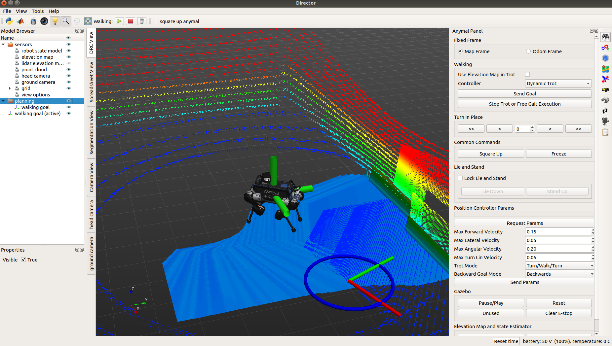
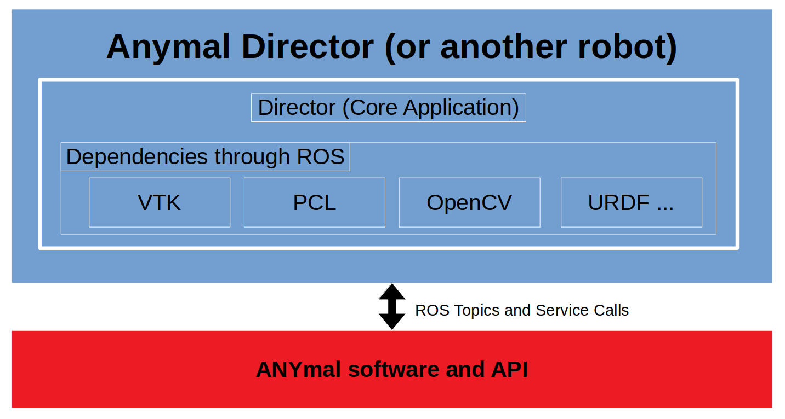

# Director

# Introduction

The (Robot) Director is an interface for remote command and control of field robots.

It is built within ROS and uses VTK for rendering. Unlike Rviz it is convenient to adapt Director to be tightly integrated with a specific robot. VTK provides a modern scenegraph.

It's built upon a C++ base with the robot specific adaptation done in Python - making development of autonomy quicker.

System Requirements
-------------------

Currently the software is tested and used on Ubuntu 18.04 and ROS Melodic. ROS provides easy access to dependencies such as:

* PCL 1.8
* VTK 6.3
* OpenCV 3.2
* URDF/Xacro
* ROS messaging

By design, ROS is only minimally integrated and previous versions did not use ROS at all.

The original upstream (see below) is compatible and tested with MacOSX 10.11. In theory it can run on any platform where VTK and Qt are supported including Windows. It's been used on Ubuntu since 14.04.

# Usage

This Director repo is not intended for usage directly. Instead it should be skinned or adapted to a specific robot (using Python). We provide a full and minimal distribution focused on the ANYmal robot from ANYbotics here:

[https://github.com/ori-drs/director_anymal_b_simple](https://github.com/ori-drs/director_anymal_b_simple)

This should be modified for your specific robot by adapting the (Python) code to match your robot's interface.

# Features

Here is a list of useful features:

* Unlike Rviz, Director is built around operation of the robot rather than analysis of signals/sensors. Efficient operation of the robot is at the centre of the design of the UI.
* Independent and stable core library (director) with Python-configurable extension for quick integration.
* Modern rendering library (VTK) with a scenegraph.
* Integrated within ROS with few specific dependencies. Dependencies and Director compiles in 90 seconds.
* Proper integrated tools for capturing videos with proper 16:9 aspect ratios. Support for flythroughs, orbiting and setting of camera angles.
* Shortcuts for changing the view angle which are robot centric e.g. 'r' resets the camera near the robot. 't' gives a top-down view
* Integrated Python interface directly accessable (via F8).
* Interactive goal setting. 'Ctrl+click' sets 3D goal for robot. 'Ctrl+Enter' executes the goal.
* All dependencies are BSD Licensed.

The video below provides an example of the interface applied to ANYmal.

# History

This repo (from Oxford Dynamic Robot Systems Group) is a fork of the original [Director master](https://github.com/RobotLocomotion/director). Originally Director was developed as the primary user interface used by Team MIT in the DARPA Robotics Challenge.

This previous version was heavily integrated with Drake and did not use ROS. It continues to be developed as the user interface for Drake by Toyota Research Institute. [Link to RobotLocomotion/TRI's version of Director](https://github.com/RobotLocomotion/director).

# Citing

If you wish to cite the Director, please use this publication from the MIT DARPA Robotics Challenge Team:

    @article{2017JFR_marion,
      title = {Director: A User Interface Designed for Robot Operation With Shared Autonomy},
      author = {Pat Marion and Maurice Fallon and Robin Deits and Andr\'{e}s Valenzuela and
      Claudia P\'{e}rez D'Arpino and Greg Izatt and Lucas Manuelli and
      Matt Antone and Hongkai Dai and Twan Koolen and John Carter and
      Scott Kuindersma and Russ Tedrake},
      journal = "J. of Field Robotics",
      year = 2017,
      month = mar,
      volume = 34,
      issue = 2,
      pages = {225-426},
    }
